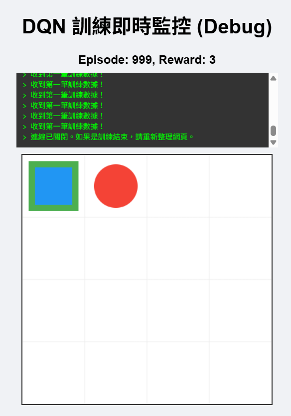
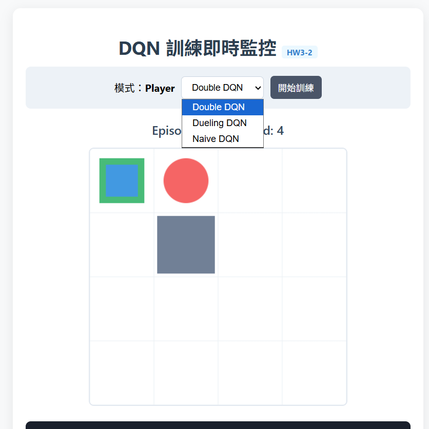
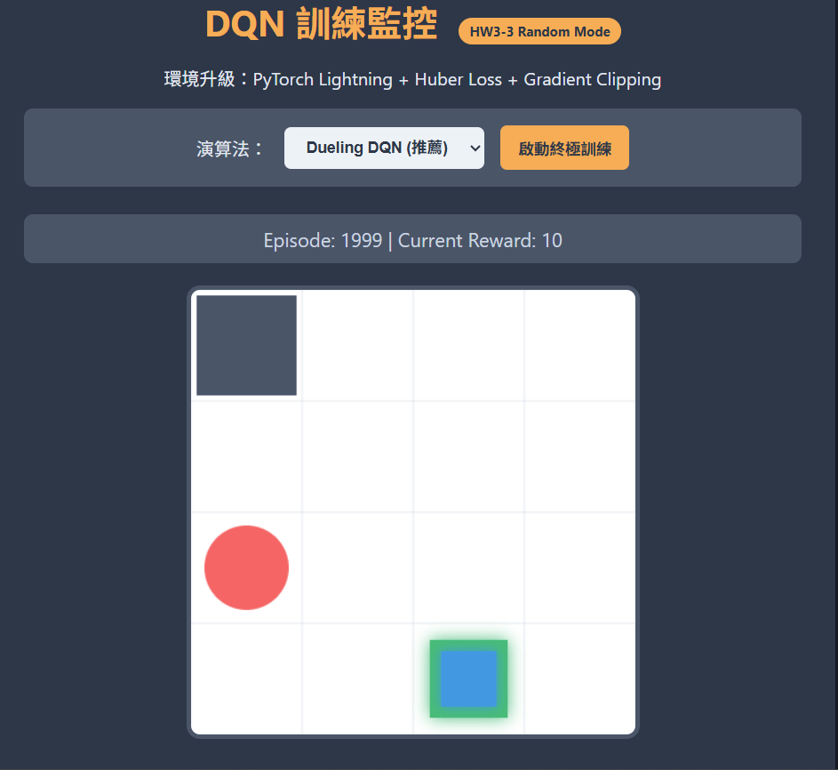

# 深度強化學習：GridWorld 專案報告 (HW3)

本專案實作了從基礎到進階的深度強化學習（Deep Reinforcement Learning）模型，用於解決不同複雜度的 GridWorld 任務。專案涵蓋了標準 DQN 及其進階變體，並在最終階段將架構遷移至 PyTorch Lightning 框架以提升訓練穩定性。

---

## 📋 任務總覽與成果分析

### HW3-1: 基礎 DQN 與靜態環境
* **實驗目標**：在物件位置固定的環境中，驗證基礎 DQN 的學習路徑規劃能力。
* **環境配置**：玩家固定在 (0,3)，目標在 (0,0)，陷阱在 (0,1)，牆壁在 (1,1)。
* **實驗表現**：模型在約 50 回合後成功將報酬轉正。最終穩定以約 6 步的最優路徑抵達目標，平均報酬維持在 +3 至 +4。



---

### HW3-2: 進階 DQN 變體比較 (Double & Dueling)
* **實驗目標**：在「玩家隨機起點」的環境下，對抗 $Q$ 值過度估計問題並提升空間價值判斷能力。
* **核心技術**：
    * **Double DQN**：拆分「動作選擇」與「數值評估」，有效緩解 Naive DQN 的過度估計偏誤。
    * **Dueling DQN**：將網路架構拆解為狀態價值 ($V$) 與動作優勢 ($A$)，優化對地圖格點價值的識別。
* **實驗表現**：Dueling DQN 在 Episode 70 即展現出極強的泛化能力，能穩定處理隨機生成的起始狀態。



---

### HW3-3: 框架升級與數值穩定性強化
* **實驗目標**：挑戰難度最高的「全隨機模式」，所有物件位置在每局均會變動。
* **核心技術**：
    * **PyTorch Lightning**：將 Agent 結構重構，提升程式碼的模組化與實驗重現性。
    * **Huber Loss (SmoothL1Loss)**：降低對極端預測誤差的敏感度，防止參數因隨機困難關卡而跑飛。
    * **梯度裁剪 (Gradient Clipping)**：強制限制梯度範數，確保在動態環境中訓練不會崩潰。
* **實驗表現**：即便在環境劇烈變動下，模型在 1200 回合後展現出穩定的獲勝能力，證明了上述技術在動態任務中的必要性。



---

## 🚀 運行說明

### 1. 安裝環境
請確保已安裝以下必要套件：
```bash
pip install torch pytorch-lightning fastapi uvicorn numpy

2. 執行 HW3-1 & HW3-2
啟動後端：uvicorn main:app --reload --host 0.0.0.0 --port 8000

存取面板：

HW3-1: 造訪 static/index.html

HW3-2: 造訪 static/index2.html

3. 執行 HW3-3
啟動後端：uvicorn main3:app --reload --host 0.0.0.0 --port 8000

存取面板：造訪 static/index3.html

🛠️ 檔案結構說明
Gridworld.py / GridBoard.py: 核心環境邏輯定義。

agents.py: Naive / Double / Dueling DQN 演算法實作。

agents_lightning.py: 基於 PyTorch Lightning 的進階 Agent，包含 Huber Loss 與梯度裁剪。

main.py / main3.py: FastAPI 後端介面，負責即時數據傳輸。